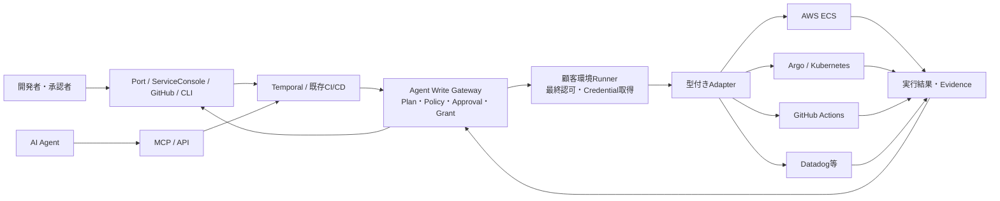

# Agent Write Gateway

> **Prototype / not production ready.** The current implementation has a PostgreSQL/Temporal durable core, a fail-closed Runner authorization boundary, a typed GitHub Actions adapter, and Datadog evidence classification. It still lacks production KMS/JWKS discovery, Runner transport integration, and a completed dedicated-staging deploy/rollback exercise. It must not be connected to production credentials or production write APIs.

Agent Write Gateway is an open-source Change Execution Control Plane for planning, authorizing, executing, verifying, stopping, and auditing changes requested by people, CI, CLIs, or AI agents through the same deterministic safety boundary.

The current repository is an executable prototype. It performs no external writes and demonstrates safety properties with versioned Service Contracts and Release Profiles, PostgreSQL records/read projections, Temporal workflow history, and a mock deploy/verify/rollback adapter. An in-memory store and the original synchronous Engine remain only as test and migration compatibility paths. The original 20-service JSON catalog remains available through an explicit compatibility adapter.

## What the prototype demonstrates

- dependency validation, cycle detection, and deterministic release phases
- typed dependency semantics for rollout, schema, runtime, shared failure domains, migrations, and traffic
- canonical Contract, Profile, and Plan v2 hashes with expiry and context pinning
- fail-closed validation for unknown references, profiles, capabilities, and schema versions
- plan hashes that do not depend on input order
- separate requester and delegated-agent identities
- fail-closed policy checks for agent scope, CI, and dependency health
- `ALLOW`, `DENY`, and `REQUIRE_APPROVAL` decisions
- role checks, separation of duties, approval expiry, and plan-hash binding
- request idempotency and execution idempotency keys
- four-value deploy verification, independently recorded rollback, rollback verification, escalation, and downstream stopping
- audit records for subjects, policy inputs, decisions, and operations
- optimistic state versions and a deliberately limited HTTP API
- durable Approval, pause, resume, cancel, retry, and recovery through Temporal
- transactional audit/outbox persistence and database-enforced execution idempotency
- canonical, signed `awg.protocol/v1alpha1` Action Grants and strict decoding
- OIDC signature/issuer/audience/expiry verification and trusted delegation scope checks
- monotonic OPA policy layers with a mandatory local baseline
- Runner capability allowlists, durable nonce journal, replay protection, and disconnect-safe reconciliation
- public typed Adapter SDK and explicit retryable/terminal/unknown error taxonomy
- allow-listed GitHub Actions deploy/rollback workflows with external run IDs and timeout reconciliation
- Runner-local GitHub and Datadog credential brokers that never return secrets to the Control Plane
- Datadog `PASS`, `FAIL`, `INCONCLUSIVE`, and `MISSING` evidence with canonical hashes

## Safety boundary

Values such as agent scopes, approver roles, CI status, dependency health, and service metadata are demo inputs today. They are not trusted production identity or evidence.

| Prototype input | Required production source |
|---|---|
| Agent scopes | verified short-lived delegation from an identity provider |
| Approver roles | identity provider or organization directory |
| `ci_success` | typed read adapter for the CI system |
| `dependencies_healthy` | typed runtime or observability evidence |
| Service metadata | versioned Service Contracts and trusted dynamic sources |

The target architecture separates a Control Plane from a Customer Environment Runner. Production credentials remain in the customer environment. The Runner accepts only signed, narrowly scoped Action Grants, re-evaluates pinned policy locally, obtains short-lived credentials, and invokes typed adapters. Arbitrary shell, arbitrary HTTP, and generic cloud APIs are not exposed.

See the [architecture overview](docs/architecture/overview.md), [threat model](docs/security/threat-model.md), and [architecture decisions](docs/adr/README.md) before extending an execution path.

## Run the prototype

Go 1.26.6 or later is required. YAML decoding uses the maintained `go.yaml.in/yaml/v3` module; no JSON Schema runtime is required.

```bash
make test
make compose-up
```

The default process loads `examples/contracts` and `examples/profiles`. To exercise the legacy JSON catalog compatibility adapter instead:

```bash
go run ./cmd/gateway -config config/gateway.example.yaml -catalog config/services.json
```

The durable runtime uses PostgreSQL for records/read projections and Temporal
for active workflow history. Start PostgreSQL, Temporal, the Gateway, and a
separate Worker with:

```bash
make compose-up
```

Configuration is loaded from `config/gateway.example.yaml`; `AWG_DATABASE_URL`,
`AWG_TEMPORAL_ADDRESS`, and the other `AWG_*` variables override file values.
The compose stack is intended for local development, not production operation.

Packet 04 provides a Runner process scaffold with validated GitHub Actions and Datadog configuration and a health-only inbound endpoint:

```bash
go run ./cmd/runner -config config/runner.example.yaml -check-config
```

The Runner execution core invokes the public typed Adapter SDK only after Grant, identity, policy, audit, and replay checks. It exposes no arbitrary command, HTTP, workflow path, or cloud API field. Production configuration requires durable journal storage, customer-managed trust keys, allow-listed GitHub/Datadog targets, and Runner-local short-lived credential files. The inbound Action Grant transport is intentionally deferred to Packet 05, so the health endpoint continues to report `accepting_actions: false`.

GitHub target workflows must declare the fixed `awg_*` inputs and use the correlation run name `awg:${{ inputs.awg_idempotency_key }}`. A dispatch timeout is reconciled by that title and is never blindly retried. See ADR-0007 before enabling a staging adapter.

`examples/release.json` uses the versioned `ReleaseIntent` envelope. The same HTTP paths continue to accept the original unversioned `ReleaseRequest` JSON for compatibility.

In another terminal, create a plan:

```bash
curl -sS -X POST http://localhost:8080/v1/release-runs:plan \
  -H 'Content-Type: application/json' \
  --data-binary @examples/release.json
```

Start the same request. The default adapter is a mock and performs no external write:

```bash
curl -sS -X POST http://localhost:8080/v1/release-runs \
  -H 'Content-Type: application/json' \
  --data-binary @examples/release.json
```

## API

```text
GET  /healthz
GET  /v1/services
POST /v1/release-runs:plan
POST /v1/release-runs
GET  /v1/release-runs/{id}
GET  /v1/release-runs/{id}/events
POST /v1/release-runs/{id}/cancel
POST /v1/release-runs/{id}/pause
POST /v1/release-runs/{id}/resume
POST /v1/release-runs/{id}/approvals/{approvalID}/approve
POST /v1/release-runs/{id}/approvals/{approvalID}/deny
```

The prototype approval body is:

```json
{
  "actor": "sre-user-1",
  "roles": ["service-owner", "sre"]
}
```

`roles` is a prototype-only input. A production implementation must resolve roles from the authenticated subject on the server.





## Package map

```text
cmd/gateway       HTTP server composition root
cmd/runner        customer Runner configuration and process scaffold
internal/api      deliberately limited external API
internal/application release use cases and workflow/outbox dispatch
internal/catalog  prototype service metadata loader
internal/contract versioned Service Contract loading, validation, canonicalization
internal/profile  versioned Release Profile loading, validation, canonicalization
internal/domain   dependency, plan, run, step, approval, and audit model
internal/planner  typed dependency graph and canonical Plan v2 generation
internal/grant    Action Grant signing boundary and strict verification
internal/identity verified OIDC subjects and trusted agent delegation
internal/policy   canonical policy input, signed bundles, and embedded OPA
internal/runner   ordered grant/policy/journal/credential/adapter enforcement
internal/verification evidence integrity and Runner-local verification service
internal/engine   synchronous migration compatibility facade
internal/executor typed adapter interface and mock implementation
internal/store    durable store contract, memory test store, PostgreSQL store
internal/workflow deterministic Temporal workflow and Activity boundaries
pkg/protocol      versioned Control Plane/Runner messages and canonical payloads
pkg/adapter       public typed deploy, rollback, reconcile, and verification SDK
pkg/credentials   Runner-local credential broker interfaces and providers
adapters/githubactions allow-listed workflow dispatch and reconciliation
adapters/datadog  fixed-query four-value metrics evidence
```

## Contributing and security

Read [CONTRIBUTING.md](CONTRIBUTING.md), [GOVERNANCE.md](GOVERNANCE.md), and [CODE_OF_CONDUCT.md](CODE_OF_CONDUCT.md) before contributing. Report suspected vulnerabilities privately as described in [SECURITY.md](SECURITY.md); do not open a public issue for a vulnerability.

Licensed under the Apache License 2.0. See [LICENSE](LICENSE).
